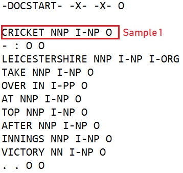

# **CoNLL-2003 Tagging Task**
In this Repository you will find 3 different models trained on the English CoNLL-2003 dataset, which can tag the sentences into their respective POS tags, Syntactic chunk tags, and NER tags.

## **Data Description**

The English CoNLL-2003 shared task data files which were present in the provided link contains four columns separated by a **single space**. Each word has been put on a separate line and there is an empty line after each sentence. The first item on each line is a word, the second a **part-of-speech (POS) tag**, the third a **syntactic chunk tag**, and the fourth the **named entity tag**.

Here, from the above we can see the structure of our dataset. Let, take the example of Sample 1 from where I have used Cricket as the Word, NNP as the POS tag, I-NP as the syntactic chunk tag, and O as the NER tag. In this way same like Sample 1 I have modeled the entire training, validation, and testing dataset.

There, are 3 files using which we can train, validate and test our model.

**eng.testa** – Dataset for validating the model.

**eng.testb** – Dataset for testing the model.

**eng.train** – Dataset for training the model. 

## **Model Architecture**

I have created 3 different models for the different tasks thus I have used a simple deep learning model architecture to train the models. We can find the model's architecture inside the `models.py` file.

**Model Summary:**

-   I have used an **embedding layer** that computes a word vector model for our words.
-   Then I have added Dropout to avoid overfitting.
-   Then an **LSTM layer** with a `Bidirectional` modifier.
-   I have set the `return_sequences=True` parameter so that the LSTM outputs a sequence, not only the final value as well as added `recurrent_dropout=0.1`.
-   After the LSTM Layer there is a **Dense Layer** (or fully-connected layer) that picks the appropriate tag. Since this dense layer needs to run on each element of the sequence, we need to add the `TimeDistributed` modifier.
-   In the last layer I have used Softmax function.
-   During compiling the model I have used `optimizer='adam', loss='categorical_crossentropy'` and `metrics=['accuracy']`.
-   I have used `save_best_only=True` to save the best model updates in the .h5 file.

## **Installation**

To run this code in your local system you have to download this repository using-

`git clone https://github.com/pranabsarkar/Conll_task.git`

Now open the downloaded directory and install the required python packages using-

`pip install -r requirements.txt`

## **Training and Evaluation**

I have used my local system for training these deep learning models.

CPU: Intel® Core™ i5-8265U @ 1.60 GHz 1.80 GHz; RAM: 8 GB

## **Further Modification’s:**

* We can use pre-trained word embedding’s like **GloVe** for better results.

* During text processing we can convert all the words into lowercase.

* If there is more training data the model can perform better.

* We can fine-tune the hyper-parameters of our model to enhance the performance of our model.

* We could have used different model architectures and compare the performances.
 

## **References**

* Introduction to the CoNLL-2003 Shared Task: Language-Independent Named Entity Recognition. Link: [https://www.aclweb.org/anthology/W03-0419.pdf](https://www.aclweb.org/anthology/W03-0419.pdf)

* Dataset Link: [https://github.com/patverga/torch-ner-nlp-from-scratch/tree/master/data/conll2003](https://github.com/patverga/torch-ner-nlp-from-scratch/tree/master/data/conll2003)

* Keras Documentation. Link: [https://keras.io/guides/](https://keras.io/guides/)

* https://www.deeplearning.ai/

## Author

Name: Pranab Sarkar

Please feel free to add your input's :)